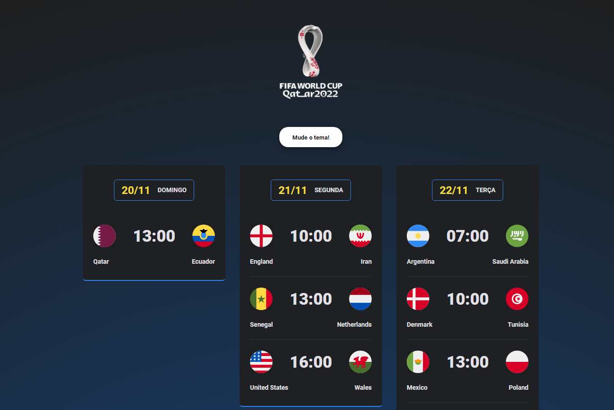

<h1 align="center">NLW Copa</h1>

The project was developed for the games of the 2022 World Cup tournament. 

  <a href="#-tecnologias">Technologies</a>&nbsp;&nbsp;&nbsp;|&nbsp;&nbsp;&nbsp;
  <a href="#-projeto">Project</a>&nbsp;&nbsp;&nbsp;|&nbsp;&nbsp;&nbsp;
  <a href="#-layout">Layout</a>&nbsp;&nbsp;&nbsp;|&nbsp;&nbsp;&nbsp;
  <a href="#memo-licença">License</a>

  

 

  

## 🚀 Technologies

This project was developed with the following technologies:

- HTML/CSS
- JavaScript
- Git/Github

## 💻 Project

The Cup Calendar is a project that lists the games of the 2022 World Cup.

## 🔖 Layout

You can view the layout of the project through [DESSE LINK](https://www.figma.com/community/file/1169028052212317700). You need to contact [Figma](https://figma.com) to access it.

## License

This project is under the MIT license.

---
